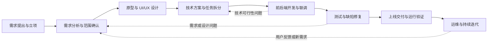

# 传统软件开发流程与文档体系

更新时间：2026-07-15

> 本文梳理 Agent 出现之前，软件团队通常如何从客户需求走到上线与运维。它用于建立后续讨论 Agent 工作法时的对照基线，不包含 AI 编码、Agent 协作或自动化编排方法。

## 0. 使用方式与基本判断

传统软件开发的核心不是“按顺序写很多文档”，而是通过**角色分工、阶段产物、评审验收和交接**，持续降低以下不确定性：

- 要做什么：需求、范围和优先级是否明确；
- 做成什么样：交互、视觉、数据和业务规则是否可理解；
- 怎么做：架构、接口、任务边界和风险是否可执行；
- 做得对不对：功能、性能、安全和兼容性是否经过验证；
- 能否稳定交付：部署、监控、回滚和运维责任是否明确。

流程有主线，但不是单向瀑布。需求澄清、设计、开发和测试之间会持续回流；每一次回流都应留下可追溯的变更记录，而不是只在口头沟通中完成。

## 1. 全流程总览

| 阶段 | 要解决的问题 | 主要输出 | 常见责任角色 |
| --- | --- | --- | --- |
| 需求提出与立项 | 为什么做、为谁做、做多大 | 客户材料、初步需求、项目目标 | 客户、业务方、产品经理、项目经理 |
| 需求分析与范围确认 | 本次版本具体做什么、不做什么 | 需求文档、PRD、范围说明、优先级 | 产品经理、业务方、项目经理 |
| 原型与 UI/UX 设计 | 用户如何使用、页面如何呈现 | 流程图、原型、交互说明、UI 设计稿 | 产品经理、UX/UI 设计师 |
| 技术方案与任务拆分 | 系统如何实现、由谁实现 | 架构/技术方案、数据和接口设计、任务清单 | 技术负责人、架构师、前后端负责人 |
| 开发与联调 | 将设计转化为可运行的软件 | 前后端代码、接口实现、联调记录 | 前端、后端、客户端工程师 |
| 测试与缺陷修复 | 是否满足交付标准 | 测试用例、缺陷单、测试报告、发布结论 | QA、研发、产品经理 |
| 上线交付与运行验证 | 是否能安全稳定地被真实用户使用 | 发布记录、部署说明、监控项、验收记录 | DevOps/运维、研发、QA、业务方 |
| 运维与持续迭代 | 是否稳定运行、下一步改什么 | 运维手册、故障记录、版本计划、迭代需求 | 运维、产品、研发、项目经理 |

## 2. 阶段一：需求提出、访谈与立项

### 2.1 目的

将客户、业务部门或市场提出的模糊诉求，转成团队可继续分析的问题定义。此阶段尚不要求给出完整解决方案，但必须避免“只凭一句需求就开始开发”。

### 2.2 典型输入

- 客户访谈、业务会议纪要、竞品或市场信息；
- 现有系统资料、业务流程、数据样本和可用素材；
- 项目背景、目标用户、预算、时间和合规约束。

### 2.3 主要活动

1. 访谈利益相关方，识别使用者、决策者、维护者和受影响对象。
2. 梳理现状流程、问题、目标和成功标准。
3. 明确项目边界：本期要解决什么、暂不解决什么。
4. 识别关键假设、依赖项和早期风险。

### 2.4 交付物

- 《需求访谈记录》或会议纪要；
- 《项目背景与目标说明》；
- 《初步需求清单》；
- 《项目立项/范围说明》（复杂项目可包含预算、排期和风险）。

### 2.5 阶段出口

业务方与项目负责人认可：问题定义正确、目标可衡量、下一阶段可以开始需求细化。

## 3. 阶段二：需求分析与范围确认

### 3.1 目的

把“想要一个系统/功能”转化为可设计、可开发、可测试的需求，并形成各方共同确认的版本范围。

### 3.2 主要活动

1. 拆分业务流程、用户角色、使用场景与异常场景。
2. 明确功能清单、业务规则、数据字段、权限和状态流转。
3. 设定优先级，区分本期必做、可选和后续版本内容。
4. 与设计、技术和测试提前核对可行性及验收方式。

### 3.3 主要文档

| 文档 | 解决的问题 | 最低应包含的内容 |
| --- | --- | --- |
| 需求规格说明书 / PRD | 做什么 | 背景、目标、用户、范围、流程、功能、规则、优先级、验收标准 |
| 功能清单 | 做与不做的边界 | 功能名称、说明、优先级、所属版本、负责人 |
| 业务流程图 | 业务如何流转 | 角色、触发条件、关键节点、分支和异常 |
| 用户故事 / 用例 | 谁在何种情境下完成什么 | 角色、场景、操作、结果、验收条件 |
| 需求变更记录 | 为什么发生变化 | 变更内容、原因、影响、确认人、版本 |

### 3.4 阶段出口

需求经业务方、产品、技术和测试共同评审。任何尚未确认的事项应标为“待确认”，不得被当作已确定需求直接开发。

## 4. 阶段三：原型、交互与视觉设计

### 4.1 目的

把需求转换为用户可理解、研发可实现、测试可验证的产品体验说明。

### 4.2 主要活动

1. 设计信息架构、页面结构和用户操作路径。
2. 产出低保真原型，确认关键流程、页面状态和交互规则。
3. 完成视觉设计，定义布局、颜色、字体、图标、组件和响应式规则。
4. 标注空状态、加载状态、错误状态、权限不足和异常操作等非正常路径。

### 4.3 主要文档与产物

- 《用户流程图》：从进入到完成任务的关键路径；
- 《原型图/线框稿》：页面结构、功能入口与交互；
- 《交互说明》：触发条件、状态变化、校验、提示与异常处理；
- 《UI 设计稿》：视觉界面及多端适配方案；
- 《设计规范/组件说明》：颜色、排版、间距、组件状态和复用规则；
- 《设计交付清单》：页面、状态、素材、标注和待确认事项。

### 4.4 阶段出口

产品确认体验符合需求；研发确认设计可实现；测试可以据此编写测试用例。若设计与技术实现冲突，应回到需求或设计层处理，而不是由开发人员自行猜测。

## 5. 阶段四：技术方案、数据设计与任务拆分

### 5.1 目的

确定实现路径，将需求和设计转化为可分配、可估算、可验证的工程任务。

### 5.2 主要活动

1. 选择或确认系统架构、模块边界和技术栈。
2. 设计数据模型、数据库、状态机、权限和关键业务规则。
3. 定义接口契约与前后端协作方式。
4. 识别外部服务、依赖系统、性能、安全和上线风险。
5. 按功能或技术能力拆分任务，估算工作量并安排迭代。

### 5.3 主要文档

| 文档 | 典型内容 |
| --- | --- |
| 技术方案 / 架构设计 | 系统边界、模块关系、关键选型、风险与替代方案 |
| 数据库设计 | 实体、字段、关系、索引、约束、迁移策略 |
| 接口文档 | 路径、方法、鉴权、请求与响应、错误码、示例、版本策略 |
| 任务拆分与排期 | 任务目标、依赖、负责人、工时、验收标准、状态 |
| 开发规范 | 分支、提交、代码审查、环境变量、日志、异常处理与安全约束 |

### 5.4 阶段出口

技术负责人确认方案可实现、风险可控；前端、后端和测试对接口、数据与验收口径达成一致；任务具有明确负责人和完成定义。

## 6. 阶段五：开发、联调与代码审查

### 6.1 开发组织

传统团队通常按前端、后端、客户端、数据库或基础设施分工。各角色独立实现后，通过接口契约和联调环境组合为完整功能。

### 6.2 主要活动

1. 创建开发分支、准备本地与测试环境。
2. 按任务实现前端页面、后端服务、数据库变更或基础能力。
3. 编写必要的单元测试、接口测试或自动化检查。
4. 进行代码审查，检查功能、可维护性、安全和规范。
5. 前后端联调，处理接口字段、鉴权、错误处理和状态一致性问题。
6. 将已完成内容部署到测试环境，交由测试验证。

### 6.3 主要产物

- 源代码、数据库迁移脚本、配置变更；
- 接口实现与联调记录；
- 代码审查记录、合并请求或变更说明；
- 开发自测记录与环境说明。

### 6.4 开发完成的最低定义

不能只以“代码已写完”判断完成。至少应满足：功能满足已确认需求、异常路径已考虑、接口可联调、代码经过审查、必要测试已通过，并且交付给测试的版本可部署、可追踪。

## 7. 阶段六：测试、验收与缺陷修复

### 7.1 测试层次

| 测试类型 | 关注点 |
| --- | --- |
| 单元测试 | 函数、类或独立模块是否符合预期 |
| 接口测试 | 服务接口的输入、输出、鉴权、错误码和边界条件 |
| 集成测试 | 多个模块或服务连接后是否正确协作 |
| 功能测试 | 功能是否符合 PRD、原型和业务规则 |
| 端到端测试（E2E） | 用户从开始到完成任务的完整路径是否可用 |
| 性能、安全、兼容性测试 | 在目标负载、威胁与设备环境下是否可接受 |
| 回归测试 | 修复或新功能是否破坏既有功能 |

### 7.2 主要文档

- 《测试计划》：范围、策略、环境、人员、排期和风险；
- 《测试用例》：前置条件、步骤、预期结果和优先级；
- 《缺陷单》：复现条件、实际结果、期望结果、严重级别、责任与状态；
- 《测试报告》：覆盖情况、缺陷统计、遗留风险和发布建议；
- 《验收记录》：业务方对交付范围的确认结论。

### 7.3 阶段出口

已知缺陷被修复、接受或明确延期；高风险问题没有未处理项；测试、研发、产品和发布负责人对上线结论达成一致。

## 8. 阶段七：上线交付、运行验证与运维

### 8.1 上线前准备

- 明确发布范围、版本号、依赖变更和数据库变更；
- 准备部署步骤、配置项、数据备份与回滚方案；
- 设置日志、监控、告警和关键业务指标；
- 确认发布窗口、责任人和沟通渠道。

### 8.2 上线后的工作

1. 按发布计划部署并记录实际操作。
2. 执行运行验证：核心页面、接口、任务、数据和监控是否正常。
3. 观察错误率、性能、业务数据和用户反馈。
4. 发生故障时按应急流程止损、修复、回滚与复盘。
5. 将用户反馈、遗留问题和新需求进入下一轮版本计划。

### 8.3 主要文档

- 《发布计划/发布单》；
- 《部署手册》与《回滚方案》；
- 《运行验证清单》；
- 《运维手册》与监控告警说明；
- 《故障记录与复盘报告》；
- 《版本发布说明》和用户使用说明。

## 9. 传统软件开发的文档体系

文档按生命周期组织，而不是按撰写者个人散落保存。下表为中小型项目的推荐最小体系；大型、强监管或高风险项目可在此基础上扩展。

| 文档域 | 核心文档 | 主要读者 | 是否建议最小必备 |
| --- | --- | --- | --- |
| 项目启动 | 背景与目标、范围、干系人、里程碑、风险 | 业务、产品、项目负责人 | 是 |
| 需求 | 访谈记录、PRD、流程图、功能清单、变更记录 | 产品、设计、研发、测试 | 是 |
| 设计 | 原型、交互说明、UI 稿、设计规范、交付清单 | 产品、设计、前端、测试 | 有界面时是 |
| 技术 | 技术方案、数据设计、接口文档、任务拆分、开发规范 | 技术负责人、研发、测试、运维 | 是 |
| 开发 | 代码、变更说明、审查记录、联调记录、自测记录 | 研发、测试、运维 | 是 |
| 测试 | 测试计划、用例、缺陷单、测试报告、验收记录 | 测试、研发、产品、业务 | 是 |
| 发布与运维 | 发布单、部署/回滚、监控、运行验证、故障复盘 | 运维、研发、项目负责人 | 是 |

## 10. 文档治理规则

### 10.1 单一事实源

每类关键信息应有一个权威位置。例如：需求范围以已确认 PRD 为准，接口字段以接口文档为准，缺陷状态以缺陷系统为准。禁止多个文档长期维护同一字段而互相矛盾。

### 10.2 版本与变更

- 需求、设计、接口和发布信息发生变化时，应记录版本、变更内容、影响范围、确认人和日期。
- 重大变更要重新评估设计、开发任务、测试范围和上线风险。
- 已经发布的版本要能回溯到当时对应的需求、代码、测试结论和发布记录。

### 10.3 交接不以“发链接”结束

交接方应说明交付内容、当前状态、未决问题、风险、依赖和验收方法；接收方应确认内容完整且可使用。没有确认的交接，只是信息传递，不是责任转移。

## 11. 最小可执行检查清单

### 开发开始前

- [ ] 需求范围和验收标准已确认。
- [ ] 原型/设计或交互说明足以支持实现。
- [ ] 技术方案、接口与数据变更已评审。
- [ ] 任务已拆分，负责人、依赖和完成定义明确。

### 提交测试前

- [ ] 研发已完成自测，前后端已联调。
- [ ] 代码已审查，数据库和配置变更可部署。
- [ ] 测试环境、测试数据和版本信息清楚。
- [ ] 已知限制、风险和待确认项已显式说明。

### 上线前

- [ ] 测试结论与遗留风险已确认。
- [ ] 发布、回滚和运行验证步骤可执行。
- [ ] 监控、日志、告警和责任人已就绪。
- [ ] 业务方已知晓上线范围、时间和影响。

## 12. 传统流程的局限与价值

传统流程的价值在于：通过专业角色分工和正式交付物，让复杂协作可追踪、可评审、可验收。它的常见问题也很明确：交接成本高、反馈周期长、信息容易在文档与会议之间丢失，且文档与实际实现可能逐渐脱节。

因此，后续引入任何 Agent 工作法时，不能只比较“写代码快不快”，还应比较它是否改善了需求理解、上下文传递、设计到实现的一致性、测试覆盖、变更可追溯性和交付责任。这些传统流程原本承担的职责，仍然需要被可靠地保留。
