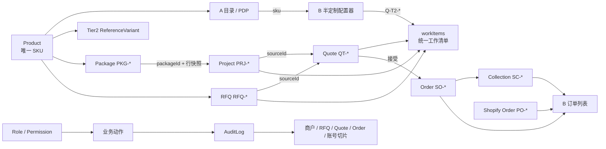

# Madehall 原型数据引用图 v1.2

> 文件名沿用 `v1.0`，内容已升为 v1.2；事实优先级：`《00-需求差异矩阵》v4.10 > 手册首页 v4.9＋v4.10 停用口径 > 手册其余未停用条目 > 视图演示文案`。

## 〇、统一事实源与引用规则

### 0.1 数据层职责

| 数据层 | 唯一职责 | 禁止事项 |
|---|---|---|
| `SHARED` | 跨稿公共契约：全局数值、14 态对客文案、单号前缀、跨稿单据镜像 | 不再维护第二份产品或参考变体事实；白名单与参考变体由 `MADEHALL_DATA` 派生 |
| `MADEHALL_DATA.products` | 产品唯一事实源，SKU、名称、品类、档位、价格、MOQ、配置摘要 | 不允许按品类复用同一产品对象 |
| `catalogSets` / `semiCustom` | 仅保存产品 SKU 与目录/参考变体属性 | 不复制产品名称作为主键；不允许悬空 SKU |
| `packages` / `project` / `rfqs` | 业务父单与产品行 | 行项只引用产品 SKU；项目以 `packageId` 指向来源套餐 |
| `quotes` | 正式报价单实体 | 必须以 `sourceType + sourceId` 唯一指向 RFQ 或项目 |
| `workItems` | B/C “询价与报价”统一工作清单 | 只做聚合索引，不冒充 Quote 事实源；旧名 `inquiries` 仅为兼容别名 |
| `orders` / `collections` / `shopifyOrders` | 自研销售订单、期款单、Shopify 只读订单镜像 | `SO → SC` 和 `QT → SO` 必须双向可追；`PO` 不进入自研订单状态机 |
| `merchantApplications` / `companies` / `accounts` | 商户申请、Company GID 与账号主数据 | 显示名不是主键；审核与开通按 `applicationNo` 勾稽 |
| `designRounds` / `assets` | Tier3 设计轮次和交付资产 | 每个资产以 `rfqId + roundId` 关联，交付资产再关联 `SO` |
| `auditLog` / `supportExceptions` | 业务留痕和人工例外 | 必须保存对象 ID、理由、操作者；禁止仅写展示文本 |
| 视图内会话数据 | 准入动作、权限、审计、客服例外等交互演示 | 不得覆盖上述跨稿实体；刷新可复位的演示数据不得宣称持久化 |

### 0.2 不变量

- 产品 SKU：`ABC-nnnn-nn`，正则 `^[A-Z]{3}-\d{4}-\d{2}$`；一 SKU 对应一产品。
- A 目录：住宅 `10×4`、工程 `16×5`，共 120 个独立目录 SKU；目录卡、PDP、B 配置器始终传同一 SKU。
- 全局：整单最低成交 `USD 25,000`、首期/定金 `30%`、余款 `70%`、仓储 `14 天`、`DDP 到门`、币种 `USD`。
- 每个引用必须满足：父实体存在、来源 ID 存在、状态镜像一致、金额可勾稽、跨页回链携带当前 ID。
- v4.10 当前口径：Tier2 由参考变体承载；参考价不再由规则引擎场景承载；未登录不展示任何价格；已停用条目不得反向写回。
- 快照口径：`project.lines !== package.lines`、`quote.charges !== project.charges`；值相同不等于可以共享可变数组。
- 订单口径：只有已接受的正式 `Quote` 能生成 `SO`；`SC` 合计必须等于对应 `SO`；`PO` 明确为 Shopify 侧只读边界。

### 0.3 总体数据流

## 1. 商户准入线（A 页6 × C 区1/区2）

| 链节点 | 主键/引用 | 下游一致性 |
|---|---|---|
| A 申请表/魔法链接 | `applicationNo`、邮箱摘要 | 成功页、过期重发页引用同一申请；不回显敏感资料 |
| C 区1 审核 | `applicationNo` | 通过/补件/拒绝写回同一申请状态；补件重提回 `submitted` |
| C 区2 开通 | `applicationNo → companyGid` | `provisioning/provision_failed` 仅内部可见；重试幂等，不重复建号 |
| 商户状态镜像 | `merchantStateMachine.internalStates` + `publicStageByInternal` | 七态严格为 `submitted/provisioning/provision_failed/need_info/rejected/active/suspended`，派生 A 对客五档；`active/suspended` 同步登录可用性与在途单处置 |
| 审计 | `objectType=merchant, objectId` | 拒绝、补件、停用、恢复必须带备注/原因与改前改后 |

## 2. Tier1 独立散买线（A → Shopify → B）

| 链节点 | 主键/引用 | 下游一致性 |
|---|---|---|
| A 目录/PDP | `productSku`，且产品含 `t1` | 已登录才显示 B2B 价；CTA 由档位集合决定 |
| Shopify 边界 | `productSku + quantity` | 只表达最小数量/增量；原型不伪造支付结果 |
| B 订单列表 | `PO-*` | 只读展示 Shopify 状态；不可下钻，明确“详情在商城侧” |

## 3. Tier2 半定制散单线（A→B→C→B）

| 链节点 | 主键/引用 | 当前实体/约束 |
|---|---|---|
| A PDP→B | `sku` | 仅含 `t2` 的产品显示配置器入口；B 按该 SKU 预填并允许下拉改选 |
| 参考变体 | `semiCustom[].sku → products[sku]` | 132 条，与全部 T2 产品一一对应；`SHARED.REF_VARIANTS` 同源派生 |
| 半定制询价 | `Q-T2-* → productSku` | `Q-T2-0620`、`Q-T2-0611`、`Q-T2-0597` 进入 `workItems` |
| 正式报价/接受 | `Q-T2-* → Quote → SO-*` | 报价版本不可复活；接受后才生成 Draft Order；30/70 付款计划按 Quote 快照 |
| B 回 A | `data-original-href` 携带当前 `sku` | 返回对应 PDP，不复用上次浏览产品或错误目录高亮 |

## 4. Tier3 全定制散单线（B→C→B）

| 链节点 | 主键/引用 | 当前实体/约束 |
|---|---|---|
| RFQ 提交 | `RFQ-3021 → RCP-0900-01`；`RFQ-3026 → RCP-0900-02` | 产品必须存在且仅 T3；数量属于 RFQ，不属于取材表行 |
| C 设计任务/我的设计 | `rfqId` | 两端读取同一 `rfqs` 集合；状态、产品 SKU、数量一致 |
| 设计资产 | `rfqId + round + cadVersion` | 客户确认包、轮次历史、内部版本链都挂同一 RFQ；下载门控不复制资产 |
| 正式报价 | `QT-3021-02 → RFQ-3021` | Quote 金额 `5,912`，状态“已报价”；RFQ 与 Quote 双向引用 |
| 订单/交付 | `quoteId → SO-* → SC-*` | 接受后才建单；生产态、物流、收货信号与尾款门控挂销售订单，不回写 RFQ 金额 |

## 5. FF&E 套餐项目线（A→B→C→B）

| 链节点 | 主键/引用 | 当前实体/约束 |
|---|---|---|
| A/C 套包 | `PKG-0001…PKG-0007` | 7 个 `verticalKey` 各且仅 1 套；A/C 同名、同行项、同上下架状态 |
| 套餐行 | `package.lines[].sku` | 只允许产品可售档位与 `{T1,T2}` 交集；Tier2 必须有默认配置 |
| 工程项目 | `PRJ-1007.packageId=PKG-0001` | 项目按 `packageId` 解引用并保存完整行快照，禁止按数组第一项猜来源 |
| 整单报价 | `QT-1007-01 → PRJ-1007` | 产品行小计 `29,746`＋DDP 到门交付与履约 `2,154`＝`31,900` |
| 项目门控 | `projectId / orderId` | 报价、首期、生产与资产解锁均为项目级锚点；正式报价只有一个 Quote |

## 6. FF&E 自组项目线（A→B）

| 链节点 | 主键/引用 | 下游一致性 |
|---|---|---|
| A 项目篮 | `basketLineId + productSku + qty` | 行只引用产品；增删/数量变化不得修改产品主数据 |
| B 立项预览 | `src=custom` | 与 `src=pack` 分流；自组行读取产品完整可售档位，不套套餐模板过滤 |
| 项目生成 | `basket snapshot → PRJ-*` | 生成后使用项目行快照；后续报价引用 `projectId`，不引用浏览器篮对象 |

## 7. 单号与跨域跳转线（B×C）

| 类型 | 规则 | 互链要求 |
|---|---|---|
| 产品 | `ABC-nnnn-nn` | A PDP↔B 配置器始终携带当前 SKU |
| 询价/业务父单 | Tier2 `Q-T2-*`；Tier3 `RFQ-*`；项目 `PRJ-*` | 队列行首展示当前承载实体，不拿 Quote 号冒充父单 |
| 正式报价 | `QT-父号-版本` | `quotes[].sourceId` 可回到父单，父单 `quoteId` 可回报价 |
| 订单/收款 | 自研 `SO-*`；补收/期款 `SC-*`；Shopify 现货 `PO-*` | C/B 同名单据同号同额；`SC-*` 明示关联 `SO-*`；零 `ORD-*` 业务数据 |
| 路由 | `view + hash + sku/sourceId` | 面包屑反映本次来路，左导航高亮按实体承载域，不继承旧页面状态 |

## 8. 内部后台角色与权限线（C）

| 实体/关系 | 主键 | 一致性要求 |
|---|---|---|
| 角色 | `roleCode`（7 角色） | 可见区由角色→区映射派生；无权区不渲染 |
| 动作授权 | `actionCode → allowedRoles` | 按钮授权提示与真实可点性同源；财务区零操作控件 |
| 四眼 | `makerId/checkerId` | Quote、设计发布、成本/汇率等发布须 `maker≠checker`；root 不豁免业务硬线 |
| 账号 | `accountId + roleCode + enabled` | 建号/停用/恢复/重置/分配角色写同一账号；root 自身不提供增删入口 |

## 9. 内部主数据与四眼治理线（C）

| 主数据 | 引用/发布关系 | 一致性要求 |
|---|---|---|
| 产品档位能力 | `productSku → tiers` | C 只读，来源为 `products`；缺项显式报错，不静默放行 |
| 成本/汇率/有效期 | `draftVersion → publishedVersion` | 草稿与已发布版本分离；四眼发布，按单覆盖仅存 Quote 快照 |
| 套包管理 | `packageId → productSku[]` | CRUD、预览、上下架操作同一 `packages`；A 只消费已上架记录 |
| Factory 锚点 | `factoryId` | 只保存 id/名称/启停及订单关联；能力资质仍以飞书 Base 为准 |
| 商户主数据 | `companyGid` | 资料/账期变更为 Company 级并同步 Shopify；改前改后入审计 |
| 人工例外 | `objectId + reason + actor` | MOQ 核减、代改 BOM 等不改模板；理由必填并进入 AuditLog |

## 10. 审计留痕线（G4 × AuditLog）

| AuditLog 字段 | 来源 | 消费方 |
|---|---|---|
| `eventId / occurredAt` | 动作执行时生成 | 全部时间线排序 |
| `actorId / actorRole` | 当前登录主体 | root 代行仍记录 root，不冒名 |
| `objectType / objectId` | 商户、RFQ、Quote、SO、账号 | 五类只读切片按同一对象 ID 过滤 |
| `before / after` | 状态或权限变更 | 停用/恢复、发布、置态等勾稽 |
| `reason / proofNo` | 例外或涉钱动作 | 无理由不可提交；定金/尾款凭证号必须入痕 |

## 11. 客服与例外通道线（A×C）

| 通道 | 对象引用 | 留痕要求 |
|---|---|---|
| A 电话/WhatsApp/邮件/表单 | `sourcePage + category/productSku` | WhatsApp 与表单保留来源上下文；不创建伪 RFQ |
| 补件代传/人工代建 | `applicationNo` | 只替代操作人，不替代审核人；备注与附件入痕 |
| 邮件意见代录/代改 BOM | `rfqId + round` | 客户确认后才生效；下一轮确认包可追认 |
| 补收/物流手录 | `orderId` | `SC-*` 关联原 `SO-*`；凭证、原因与执行人入痕，不回填原 Quote |
| 变更评估 | `orderId → on_hold → supplementalQuoteId` | 大改新建补充 Quote；发运后按新单，不修改旧报价快照 |

## 12. 跨稿一致性总检

| 检查族 | 唯一来源 | 自动闸门 |
|---|---|---|
| 产品/SKU/档位 | `MADEHALL_DATA.products` | 格式、唯一、目录独立、PDP 路由、T2 变体全覆盖 |
| 套餐/项目 | `packages + project.packageId` | 7 业态唯一；行快照同源；项目金额＝行小计＋费用 |
| RFQ/Quote/工作清单 | `rfqs + quotes + workItems` | 双向引用、覆盖、状态/金额镜像 |
| 全局数值/状态/前缀 | `SHARED` | 25,000/30/70/14/DDP/USD；单号前缀；对客状态 |
| A/B/C 渲染 | 对应实体集合 | A/C 套包、B/C RFQ、B/C 工作清单、PDP↔配置器均检查绑定表达式 |
| 文档覆盖 | 本文 | 12 条大路径各有独立章节，且记录 v4.9＋v4.10 停用口径 |

## 13. 已修正的数据不一致

| 问题 | 修正 | 代价/连带 |
|---|---|---|
| `SHARED.DOCS` 的 `RFQ-3021`、`PRJ-1007` 状态落后于实体层 | 统一为“已报价”，Quote 状态/金额同步校验 | 改变统一读回卡的状态文案 |
| `RFQ-3026` 已进入 B/C 清单但缺少跨稿单据镜像 | 补入 `SHARED.DOCS`，状态统一为“报价制作中” | 公共单据字典增加 1 条记录 |
| 项目五行合计 29,746，但项目与 Quote 为 31,900 | 新增 DDP 到门交付与履约 2,154；C 报价工作面显示三段勾稽 | 报价明细增加一行，不改整单成交价 |
| 正式 Quote 与询价/RFQ 混在 `inquiries` | 新增 `quotes` 与 `workItems`；`inquiries` 只保留兼容别名 | 新代码统一读取 `workItems`，旧入口暂不破坏 |
| B 项目来源套餐按 `packages[0]` 取值 | 改为按 `project.packageId` 查找 | 避免未来项目引用非首套餐时显示错误 |
| `SHARED.REF_VARIANTS` 固定 12 条，B 实体层已有 132 条 | 改为从 `semiCustom` 派生；C 标题动态显示数量 | C 参考变体下拉项增多，但与 B 同源 |
| 同一 Tier2 SKU 在 PDP、配置器、返回页有不同价格/MOQ | 产品主数据反向吸收参考变体；PDP、配置器均按 SKU 读 `products[sku]` | 参考变体不再是第二份产品事实 |
| A 自组篮只存名称，B 用静态 WST/CHR 样例 | 自组篮保存 `basketLineId + productSku + qty + cfg`，统一路由传 `basket` 快照 ID | 新增临时会话快照；刷新原型复位 |
| 套餐→项目、项目→Quote 共享数组 | 深复制并深冻结项目行与费用快照 | 后续修改套餐不再漂移已建项目或报价 |
| Tier2 已报价项无正式 Quote，B/C 订单各用样例 | 补 `QT-0611-01`，并以统一 `orders/collections/shopifyOrders` 渲染 | 历史样例订单不再充当业务事实 |
| AuditLog 以名称/文本留痕且首期金额有误 | 新增结构化事件；`SC-3024=79,902` 固化为事件值 | 需以 objectId 而非名称筛选时间线 |

## 14. 一致性闸门（R / A / W）

- **R 结果**：命令输出 `ALL CONSISTENCY CHECKS PASSED`，并打印产品、变体、套餐、RFQ、工作项、正式报价及项目金额构成。
- **A 行动**：在 `D:\file_factory\fabbrio软件开发` 运行 `node 原型/validate-madehall-data.mjs`；失败时按错误中的实体 ID 回查 `MADEHALL_DATA`、`SHARED.DOCS` 与 A/B/C 绑定。
- **W 触发时机**：新增/修改产品、套餐、项目、RFQ、Quote、工作清单、跨页路由、状态镜像、金额或本文业务路径时执行。
