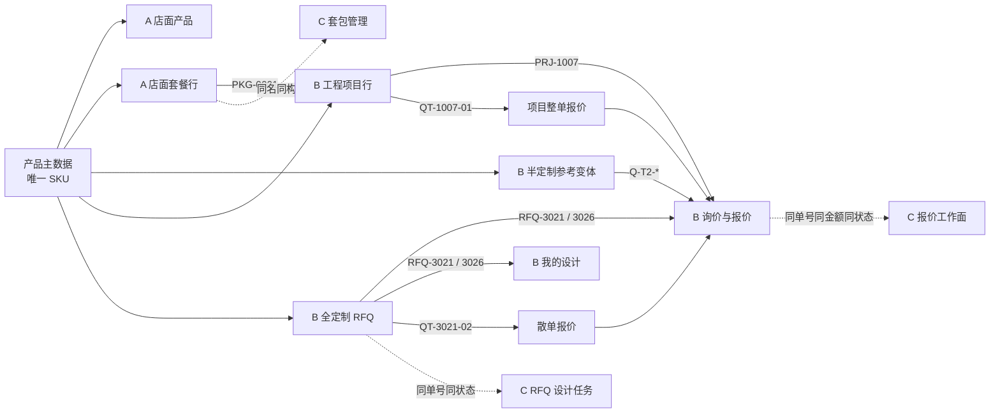

# Madehall 原型数据引用图 v1.0

## 1. 统一规则

- 产品 SKU：`ABC-nnnn-nn`，正则为 `^[A-Z]{3}-\d{4}-\d{2}$`。
- 每个 SKU 只对应一条产品记录；参考变体也使用独立 SKU，不再让多个变体共用 `RC-200` 一类旧编号。
- 套餐、半定制询价、工程项目、RFQ、报价单、订单与设计资产只保存产品 SKU 或来源单号，不复制另一条产品记录冒充新产品。
- 报价单必须带唯一来源：`QT-3021-02 → RFQ-3021`，`QT-1007-01 → PRJ-1007`。
- A 目录中的每张商品卡必须携带唯一 `data-sku`；PDP 按该 SKU 切换标题、主图、价格、规格、认证与配置器预填，禁止回落到其他产品。

## 2. 数据流向

## 3. 关键引用表

| 下游实体 | 来源 | 产品 / 来源引用 | 一致性要求 |
|---|---|---|---|
| `PKG-0001` 酒店大床房套餐 | 产品主数据 | `CHR-0030-01`、`CAB-0110-01`、`NST-0040-01`、`WRD-0120-01`、`DSK-0090-01` | A 店面与 C 套包管理同名、同行项 |
| `PRJ-1007` 海景酒店 48 间客房 | `PKG-0001` | 同上五个 SKU | 工程项目行不得出现套餐外产品 |
| `RFQ-3021` | 产品主数据 | `RCP-0900-01` | B RFQ、我的设计、询价与报价、C 设计任务一致 |
| `RFQ-3026` | 产品主数据 | `RCP-0900-02` | 同上 |
| `QT-3021-02` | `RFQ-3021` | 金额 `$5,912.00` | B/C 同单号、同金额、同状态 |
| A 目录 9 张商品卡 | 产品主数据 | 9 个唯一 SKU | 点击后进入各自 PDP，不复用默认产品状态 |
| `QT-1007-01` | `PRJ-1007` | 金额 `$31,900.00` | 行小计之和、列表金额与整单金额一致 |

## 4. 一致性闸门（R / A / W）

- **R 结果**：校验输出 `ALL CONSISTENCY CHECKS PASSED`，且无重复 SKU、悬空 SKU、缺失 RFQ/Quote 引用。
- **A 行动**：运行 `node 原型/validate-madehall-data.mjs`；失败时按报错中的实体 ID 回查 `MADEHALL_DATA` 与 A/B/C 渲染映射。
- **W 触发时机**：每次新增产品、套餐行、工程项目、RFQ、报价单，或修改 A/B/C 任一处演示数据后执行。

可视化成品：`diagrams/2026-08-01T062624/diagram.png`；可编辑源：`diagram.svg`。
